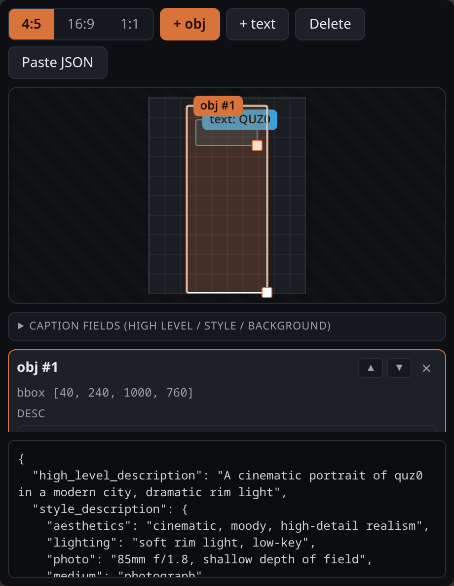

# ComfyUI — Ideogram4 Bbox Editor

A ComfyUI custom node that renders a visual bounding-box / caption editor **on the
node itself** and outputs the assembled Ideogram-4 caption (**v15 format**) as a
JSON string.


## Features

- **On-node visual editor** — draw, move and resize regions directly on the node
  (corner handle resizes, centre drags; click cycles through overlapping boxes).
- **Aspect-ratio presets** — `1:1 / 4:5 / 9:16 / 16:9 / 3:1` plus a free **custom
  `W:H`** field. The ratio drives default bbox shapes.
- **0–1000 grid** — bboxes as `[ymin, xmin, ymax, xmax]`, independent of pixels.
- **Per-element controls** — `obj` / `text` type, **optional bbox** (toggle per
  element), literal multi-line `text` for text regions, `desc`, and **z-order**
  (▲/▼ choose what sits on top).
- **Caption-level fields** — `aspect_ratio`, `high_level_description`,
  `background` (scene shell only).
- **Optional `style_description` (v14)** — off by default (v15 has no
  `style_description`). Toggle it on to add a style block with a `photo` /
  `art_style` kind, `aesthetics` / `lighting` / `medium`, and a `color_palette`
  (comma-separated `#hex`). Emitted with the canonical key order; validation stays
  silent about it. Importing a caption that has `style_description` loads it back
  into these fields.
- **Live validation panel** — flags v15 guideline issues as you type: word caps
  (HLD ≤ 50, desc ≤ 60), camera/shadow language in `desc`, floor/ground as an
  element, `"warm"` grading, post-processing in `background`, furniture/people
  smuggled into `background`, missing `text` in built environments, bad bbox, etc.
- **Word counters** on HLD and each `desc`.
- **Smart import** — paste any caption JSON, or wire one into the **`import_json`
  input**; it unwraps `caption`/`data`/`result` wrappers, doubly-encoded JSON,
  derives the ratio from `size`, and loads `style_description` into the style
  fields. The output always reflects the editor, never the raw input.
- **Copy minified / Pretty / Download**.
- **Optional `width` / `height` inputs** — set the actual target size. When both
  are > 0 the editor canvas and the output's `aspect_ratio` follow `W:H` (e.g.
  right-click → *convert to input* and wire a resolution node). `0` = use the
  aspect ratio chosen in the editor.
- **Generated-image backdrop** — after each run the latest generated image is
  captured from the frontend and shown, scaled to fit, **behind the boxes** so you
  can see where to nudge them before regenerating (no wiring — a real `IMAGE`
  input would create a graph loop). Controls: **Auto size** (grid/aspect ratio
  follow the image, else the connected `width`/`height`), a backdrop **opacity**
  slider, and **Clear backdrop**. Picking a preset / custom `W:H` switches Auto off.
- **Optional `image` input** — a reference image (e.g. `LoadImage`): dimmed behind
  the `preview` output and shown as the editor backdrop (loads on run).
- **Florence-2 auto-fill** — seed the editor from an image without embedding the
  model: wire [`comfyui-florence2`](https://github.com/kijai/ComfyUI-Florence2)'s
  `Florence2Run` outputs into `florence_caption` (→ `high_level_description`) and
  `florence_data` (→ region/OCR boxes as elements; needs `image` connected so the
  pixel boxes can be normalized). Auto-fill re-applies **only when the Florence
  output changes**, so re-runs don't clobber your edits.
  - For **labeled boxes + a prose HLD**, wire a **caption** task
    (`more_detailed_caption`) → `florence_caption`, and a **region** task's raw
    `caption` (`dense_region_caption`) → **`florence_regions`** (parsed into elements
    with `desc = label`). See `examples/florence2_autofill.json`.
  - `florence_regions` recovers the per-region labels that kijai's `data` **drops**
    for `OD` / `dense_region_caption` (`<loc_>` is normalized, so no `image` needed).
  - `florence_data` (JSON) is still accepted for boxes without labels and for OCR;
    it needs `image` connected (pixel-space).
- **Outputs**:
  - `prompt` (STRING) — the live caption JSON.
  - `preview` (IMAGE) — boxes + numbered tags + `desc`/`text` rendered over the
    canvas (or the dimmed reference image).
  - `bboxes` (BOUNDING_BOX) — pixel-space, nested `[[{x,y,width,height}]]`, ready
    for **SAM3 / crop / mask** nodes.
  - `width` / `height` (INT) — the resolved canvas size (passthrough).

## v15 output format

```json
{
  "aspect_ratio": "4:5",
  "high_level_description": "…",
  "compositional_deconstruction": {
    "background": "…",
    "elements": [
      { "type": "obj",  "bbox": [40, 240, 1000, 760], "desc": "…" },
      { "type": "text", "bbox": [110, 300, 250, 700], "text": "QUZ0", "desc": "…" }
    ]
  }
}
```

`bbox` is `[ymin, xmin, ymax, xmax]` on a 0–1000 grid and is **optional** per
element. v15 has **no** `style_description` and **no** `color_palette` — describe
style as prose inside `high_level_description` / `background`.

## Example workflow

`examples/florence2_autofill.json` — `LoadImage → Florence2Run ×2` (a
`more_detailed_caption` for the HLD and a `dense_region_caption` for the boxes)
→ **Ideogram4 Bbox Editor** → `PreviewImage`. Drag it onto the ComfyUI canvas,
point `LoadImage` at an image, run once to auto-fill the editor, then tweak and
generate. Requires [`comfyui-florence2`](https://github.com/kijai/ComfyUI-Florence2).

## Install

Clone into `ComfyUI/custom_nodes/` and restart ComfyUI:

```bash
git clone https://github.com/quzopl/comfyui-ideogram4-bbox-editor.git
```

## Usage

Add **Ideogram4 Bbox Editor** (category `Ideogram4`). Pick a ratio, add `obj` /
`text` regions, fill `desc` / `text`, write `high_level_description` and
`background`, and watch the validation panel. Wire the `prompt` output into a
text encoder (e.g. `CLIPTextEncode`) or any string consumer. Pairs naturally with
the AI Gallery metadata stack.



After you run the graph, the latest generated image appears as a backdrop and the
grid snaps to its proportions, so you can see exactly where to nudge the boxes
before the next run.

## Development

```bash
python -m pytest tests/ -v
```

## License

MIT
