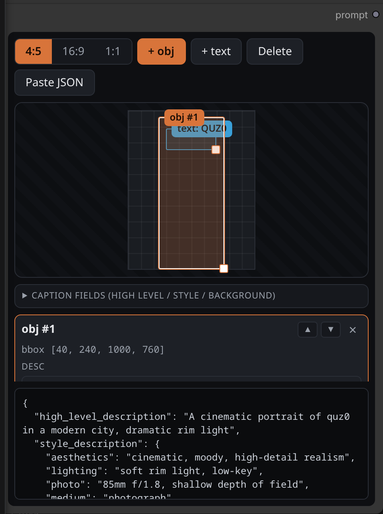

# ComfyUI — Ideogram4 Bbox Editor

A ComfyUI custom node that renders a visual bounding-box / caption editor **on the
node itself** and outputs the assembled Ideogram-4 caption as a JSON string.



## Features

- **On-node visual editor** — no separate window. Draw, move and resize regions
  directly on the node.
- **Aspect-ratio presets** — 4:5 / 16:9 / 1:1 for the working canvas.
- **0–1000 grid** — bounding boxes stored as `[ymin, xmin, ymax, xmax]` (the
  Ideogram-4 convention), independent of the canvas pixel size.
- **Per-element controls** — `obj` / `text` type, `desc`, literal `text` (for
  text regions), hex `color_palette` with live swatches, and **z-order** (▲/▼
  to choose what sits on top).
- **Overlap-friendly selection** — click cycles through stacked boxes
  (smallest first); only the selected box is draggable, so overlapping regions
  are easy to grab.
- **Caption-level fields** — collapsible section for `high_level_description`,
  `style_description` (aesthetics / lighting / photo / medium / palette) and
  `background`.
- **Paste-import** — drop in a caption JSON (even doubly-encoded, where the
  whole object is stuffed into `high_level_description` — it gets unwrapped).
- **Output** — `prompt` (STRING): the live caption JSON.

## Install

Clone into `ComfyUI/custom_nodes/` and restart ComfyUI:

```bash
git clone https://github.com/quzopl/comfyui-ideogram4-bbox-editor.git
```

## Usage

Add **Ideogram4 Bbox Editor** (category `Ideogram4`). Build your scene:

- **+ obj / + text** — add a region; drag its centre to move, drag the corner
  handle to resize.
- Click a region (or its card) to select it; click again on overlapping boxes
  to cycle. **▲ / ▼** on a card change stacking order.
- Fill **desc** / **text** / **palette** per element, and open **caption
  fields** for the high-level description, style and background.
- **Paste JSON** to load an existing caption.

Wire the `prompt` output into a text encoder (e.g. `CLIPTextEncode`) or any
string consumer. Pairs naturally with the AI Gallery metadata stack.

## Output format

```json
{
  "high_level_description": "…",
  "style_description": { "aesthetics": "…", "lighting": "…", "photo": "…", "medium": "photograph", "color_palette": ["#2A2520"] },
  "compositional_deconstruction": {
    "background": "…",
    "elements": [
      { "type": "obj",  "bbox": [40, 240, 1000, 760], "desc": "…", "color_palette": ["#2A2520"] },
      { "type": "text", "bbox": [110, 300, 250, 700], "text": "QUZ0", "desc": "…" }
    ]
  }
}
```

`bbox` is `[ymin, xmin, ymax, xmax]` on a 0–1000 grid.

## Development

```bash
python -m pytest tests/ -v
```

## License

MIT
